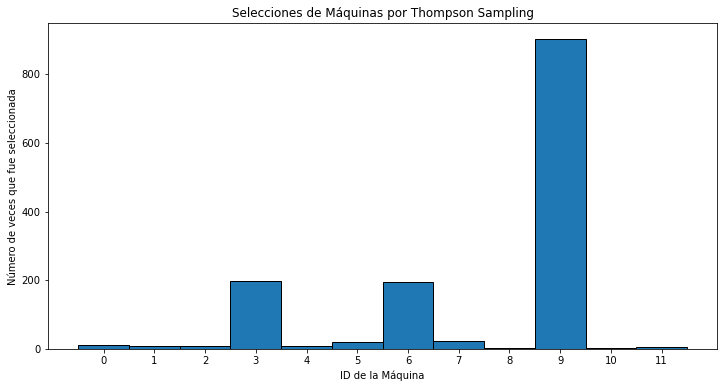
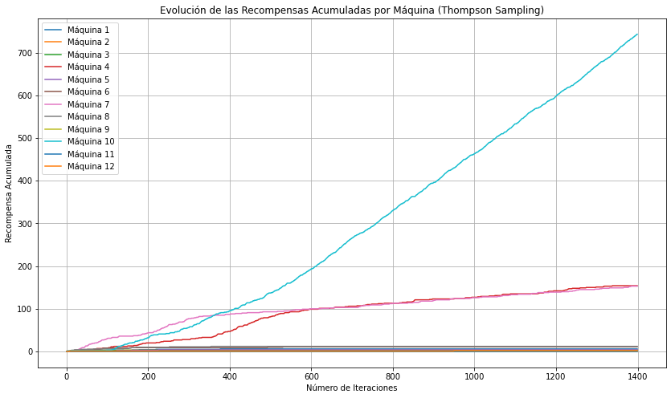

# Comparación de Algoritmos UCB y Thompson Sampling para Optimización de Máquinas Tragamonedas

## Tabla de Contenidos

1. [Descripción del Proyecto](#descripción-del-proyecto)
2. [Estructura del Proyecto](#estructura-del-proyecto)
3. [Requisitos](#requisitos)
4. [Instalación](#instalación)
5. [Generación del Dataset](#generación-del-dataset)
6. [Implementación y Comparación de Algoritmos](#implementación-y-comparación-de-algoritmos)
7. [Resultados y Análisis](#resultados-y-análisis)
8. [Conclusión](#conclusión)
9. [Referencias](#licencia)

---

## Descripción del Proyecto

Este proyecto tiene como objetivo **comparar dos algoritmos de optimización de decisiones** bajo incertidumbre: **Upper Confidence Bound (UCB)** y **Thompson Sampling**, en el contexto del problema de los **bandidos multi-brazo**. Utilizando un dataset simulado de **12 máquinas tragamonedas** evaluadas **1400 veces**, se busca determinar cuál de los algoritmos logra maximizar de manera más efectiva la recompensa total acumulada.

---

## Estructura del Proyecto

El proyecto consta de los siguientes archivos:

- `generar_dataset.py`: Script para generar un dataset aleatorio que simula 12 máquinas tragamonedas evaluadas 1400 veces.
- `ucb_vs_thompson_Sampling.py`: Script que compara el desempeño de UCB, Thompson Sampling y una estrategia de selección aleatoria.
- `maquinas_tragamonedas.csv`: Archivo CSV generado por `generar_dataset.py` que contiene los resultados de las evaluaciones de las máquinas tragamonedas.

---
## Requisitos

- - **Python 3.8+ y spyther**

### Librerías de Python
- `numpy`
- `pandas`
- `matplotlib`


## Instalación

1. **Clonar el Repositorio**
   ```bash
   git clone https://github.com/moises60/Upper-Confidence-Bound-python.git
   ```
---

## Generación del Dataset

El primer paso es generar un dataset que simule el comportamiento de **12 máquinas tragamonedas** evaluadas **1400 veces**. Este dataset almacenará los resultados de cada jugada, indicando si se obtuvo una recompensa (`1`) o no (`0`) para cada máquina.

### Archivo: `generar_dataset.py`

- **Generación de Probabilidades Reales:** Cada máquina tiene una probabilidad única de otorgar una recompensa, generada aleatoriamente entre 0 y 1.
- **Simulación de Jugadas:** Para cada máquina, se simulan 1400 jugadas donde el resultado es `1` (recompensa) o `0` (sin recompensa) basado en su probabilidad.
- **Almacenamiento del Dataset:** Los resultados se almacenan en un archivo CSV llamado `maquinas_tragamonedas.csv`.
---

## Implementación y Comparación de Algoritmos

El núcleo del proyecto consiste en **implementar y comparar** dos algoritmos de optimización de decisiones: **Upper Confidence Bound (UCB)** y **Thompson Sampling**. Además, se incluye una estrategia de **selección aleatoria** para servir como referencia.

### Algoritmo Upper Confidence Bound (UCB)

#### Descripción

El **Algoritmo Upper Confidence Bound (UCB)** es una estrategia determinística que balancea la exploración y explotación seleccionando la opción con la mayor cota superior de confianza.

### Algoritmo Thompson Sampling

#### Descripción

**Thompson Sampling** es una estrategia probabilística que utiliza inferencia bayesiana para balancear exploración y explotación. En cada iteración, se muestrea una probabilidad de recompensa para cada opción desde una distribución posterior y se selecciona la opción con la mayor probabilidad muestreada. 

### Selección Aleatoria

#### Descripción

La **Selección Aleatoria** es una estrategia básica que elige una opción al azar en cada iteración, sin utilizar información previa sobre las recompensas obtenidas. Sirve como una línea base para comparar el rendimiento de los algoritmos UCB y Thompson Sampling

---

## Resultados y Análisis

Después de ejecutar el script `ucb_vs_thompson_Sampling.py`, se obtuvieron los siguientes resultados:

- **Recompensa total obtenida por UCB:** 939.0
- **Recompensa total obtenida por Thompson Sampling:** 1091.0
- **Recompensa total obtenida por selección aleatoria:** 612.0

### Recompensas Totales

| **Algoritmo**                | **Recompensa Total** |
|------------------------------|----------------------|
| Upper Confidence Bound (UCB) | 939.0                |
| Thompson Sampling            | 1091.0               |
| Selección Aleatoria          | 612.0                |

- Esto demuestra la eficacia de los algoritmos de optimización en comparación con estrategias no informadas.

### Histograma de Selecciones





Este histograma muestra la frecuencia con la que cada máquina fue seleccionada por cada algoritmo durante las 1400 iteraciones.

- **Máquina 9** fue la más seleccionada por ambos algoritmos UCB y Thompson Sampling, indicando que es la más rentable.
- **Máquina 6 y 3** también fueron frecuentemente seleccionadas, reflejando su alto rendimiento.
- La **Selección Aleatoria** distribuyó las selecciones de manera uniforme entre todas las máquinas.

### Recompensa Acumulada a lo Largo del Tiempo


Este gráfico muestra cómo la recompensa total se acumula con cada iteración para los tres algoritmos: UCB, Thompson Sampling y Selección Aleatoria.

- **Thompson Sampling** acumula recompensas a un ritmo más rápido que **UCB**, alcanzando la mayor recompensa total.
- **UCB** también muestra un crecimiento constante en la recompensa acumulada, superando a la **Selección Aleatoria**.
- La **Selección Aleatoria** muestra un crecimiento más lento, reflejando su menor eficacia en la optimización de recompensas.

### Recompensas Acumuladas por Máquina




Este gráfico muestra cómo cada máquina ha acumulado recompensas a lo largo de las iteraciones para los algoritmos UCB y Thompson Sampling.

- **Máquina 9** muestra un crecimiento constante y rápido en la recompensa acumulada, confirmando su alta rentabilidad.
- **Máquina 6 y 3** también presentan un crecimiento notable, aunque a un ritmo ligeramente menor que la Máquina 9.
- Las demás máquinas muestran un crecimiento más lento o se estabilizan, indicando que no son tan rentables como las primeras tres.
- Ambos algoritmos UCB y Thompson Sampling enfocaron sus selecciones en las máquinas más rentables, pero Thompson Sampling lo hizo de manera más eficiente.

## Conclusión

Est demuestra de manera efectiva cómo **Upper Confidence Bound (UCB)** y **Thompson Sampling** pueden ser utilizados para optimizar la selección de máquinas tragamonedas en un entorno de incertidumbre. A través de la comparación con una estrategia de selección aleatoria, se evidenció que ambos algoritmos de optimización superan significativamente a estrategias no informadas en términos de maximización de recompensas acumuladas.

- **Thompson Sampling** logró la mayor recompensa total (1091.0), superando a **UCB** (939.0) y a la **Selección Aleatoria** (612.0). Esto demuestra su eficacia en la optimización de decisiones bajo incertidumbre.


## Referencias
Parte de el código se inspira en el siguiente repositorio: https://github.com/joanby/machinelearning-az/tree/master/original/Part%206%20-%20Reinforcement%20Learning 